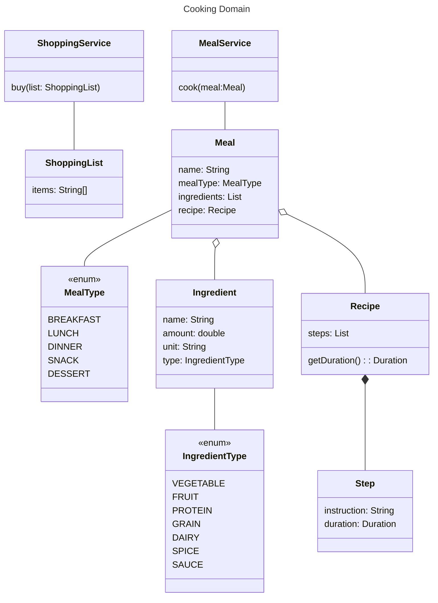

Crafting effective tests is as vital as writing clean production code. A well-structured test not only validates functionality but also serves as documentation for the system. However, creating such tests often encounters a common roadblock – the excess baggage of fluff. This includes generating test data, defining parameters for the "system under test," creating responses for mocks/stubs, and establishing expectations for asserts.

Enter reusable test data factories, introduced by Martin Fowler as the ["Object Mother."](https://martinfowler.com/bliki/ObjectMother.html) This approach streamlines the manual instantiation and population of complex text fixtures, avoiding boilerplate code.

To enhance this methodology, we turn to [Instancio](https://www.instancio.org/), a library that not only streamlines test data creation but also allows for a high degree of customization. With Instancio, we can fill our Object Mother with reasonable defaults, ensuring a seamless and efficient testing process.

Let's explore a practical example within the context of a cooking app. Consider two services – MealService and ShoppingService. Our test focuses on MealService; we validate that ShoppingService is invoked with a shopping list of essential ingredients.


```java
public class MealServiceTest {
ShoppingService shoppingService = Mockito.mock(ShoppingService.class);
MealService mealService = new MealServiceImpl(shoppingService);

    @Test
    void cookTriggersShopping() {
        Meal meal = CookingMother.meal()
                .withName("Schnitzel")
                .customize(b -> b.type(MealType.DINNER))
                .build();

        mealService.cook(meal);

        ShoppingList expectedShoppingList = CookingMother.shoppingList()
                .withIngredientItems(meal.getIngredients())
                .build();

        Mockito.verify(shoppingService).buy(expectedShoppingList);
    }
}
```

In this example, we've set up a single 'object mother' test data factory class for the entire domain. 
Its main job is to create and provide named test data builders. Once you have a builder, 
you can simply invoke the 'build()' method and obtain a fully populated complex domain object. 
Additionally, we offer several convenient customization methods, enabling users to adjust specific values within the created domain object. 
Internally, these builders leverage the capabilities of Instancio.

```java
import org.instancio.GeneratorSpecProvider;
import org.instancio.Instancio;
import org.instancio.InstancioApi;

import java.util.ArrayList;
import java.util.List;
import java.util.function.Consumer;

import static org.instancio.Select.field;

public class CookingMother {

    public static MealBuilder meal() {
        return new MealBuilder();
    }

    public static class MealBuilder {
        private static final GeneratorSpecProvider<String> MEAL_NAME_VALUE_PROVIDER = gen -> gen.oneOf("Borscht", "BBQ", "Beef Stew", "Ice cream cake");
        private static final GeneratorSpecProvider<String> INGREDIENT_UNIT_VALUE_PROVIDER = gen -> gen.oneOf("gram", "oz", "spoon");

        private final InstancioApi<Meal> instancioApi;
        private Consumer<Meal.MealBuilder> customizer;

        public MealBuilder() {
            instancioApi = Instancio.of(Meal.class)
                    .generate(field(Meal::getName), MEAL_NAME_VALUE_PROVIDER)
                    .generate(field(Ingredient::getUnit), INGREDIENT_UNIT_VALUE_PROVIDER)
                    .generate(field(Ingredient::getAmount), gen -> gen.ints().min(1).max(5));

        }

        public MealBuilder withName(String name) {
            instancioApi.set(field(Meal::getName), name);
            return this;
        }

        public MealBuilder customize(Consumer<Meal.MealBuilder> customizer) {
            this.customizer = customizer;
            return this;
        }

        public Meal build() {
            Meal meal = instancioApi.create();
            if (this.customizer != null) {
                Meal.MealBuilder builder = meal.toBuilder();
                customizer.accept(builder);
                meal = builder.build();
            }
            return meal;
        }
    }


    public static ShoppingListBuilder shoppingList() {
        return new ShoppingListBuilder();
    }

    public static class ShoppingListBuilder {

        private final List<String> items = new ArrayList<>();
        public ShoppingListBuilder withItem(String item) {
            items.add(item);
            return this;
        }

        public ShoppingListBuilder withIngredientItems(List<Ingredient> ingredients) {
            ingredients.forEach(i -> withItem(i.getName()));
            return this;
        }

        public ShoppingList build() {
            return new ShoppingList(items);
        }
    }
}
```